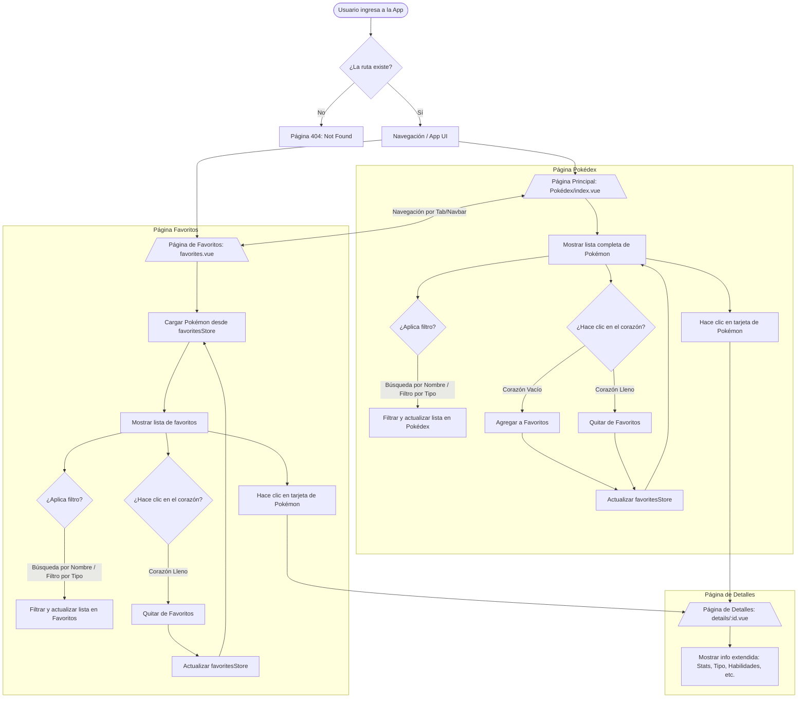

# 🧬 PokéDex Web App

Aplicación web moderna construida con **Nuxt 3** que explora el fascinante mundo de Pokémon a través de la **[PokeAPI](https://pokeapi.co/)**. Esta implementación sigue principios de arquitectura escalable e incorpora buenas prácticas de desarrollo frontend haciendo uso de Container/Presentational Pattern y Layered Architecture.

---

## 📦 Tabla de Contenidos

- 🔧 Requisitos
- 🚀 Instalación
- 🛠️ Tecnologías Utilizadas
- 📁 Estructura del Proyecto
- ✨ Principales Funcionalidades
- 📝 Decisiones Técnicas
- 🧩 Arquitectura y Patrones de Diseño
- 📊 Manejo de Estados y Errores
- 📐 Diagrama de Componentes
- 👨‍💻 Guía para Desarrollador@s
- 🔮 Posibles Mejoras Futuras

---

## 🔧 Requisitos

Version de Node recomendada: **v26.5.0**

---

## 🚀 Instalación

```bash
# Clonar el repositorio
git clone https://github.com/AndresFilatCoder/pokedex.git

# Navegar al directorio del proyecto
cd pokedex

# Instalar dependencias
npm install

# Iniciar servidor de desarrollo
npm run dev
```

---

## 🛠️ Tecnologías Utilizadas

Nuxt 3
Framework progresivo basado en Vue 3 que facilita el desarrollo de aplicaciones SSR, SSG e híbridas con estructura modular, configuración por convención y excelente rendimiento, perfecto para crear aplicaciones web modernas y escalables.

TypeScript
Lenguaje de tipado estático que mejora la mantenibilidad del código, previene errores en tiempo de desarrollo y facilita el trabajo colaborativo en proyectos medianos y grandes.

Tailwind CSS
framework CSS utility-first que permite construir interfaces altamente personalizadas mediante clases atómicas de bajo nivel directamente en el HTML. En lugar de componentes prediseñados, ofrece bloques de construcción flexibles que generan un archivo final ligero y optimizado. Perfecto para diseños únicos, rápidos y con control total de la interfaz.

Iconify
Librería que facilita la implementación de una gran variedad de iconos, los cuales se pueden personalizar en cuanto a color, tamaño, etc.

NuxtUI
Framework de componentes para Nuxt 3 que ofrece una variedad de componentes predefinidos, como botones, cards, loaders, etc. Permite una integración fácil y rápida en proyectos Nuxt 3.

---

## 📁 Estructura del Proyecto
```markdown
.
├── app                        # Código fuente principal de la aplicación
│   ├── assets                 # Estilos globales y recursos procesados por Nuxt
│   ├── components             # Componentes reutilizables de la interfaz
│   ├── composables            # Lógica reutilizable mediante Composition API
│   ├── layouts                # Plantillas reutilizables para las páginas
│   ├── pages                  # Rutas y vistas de la aplicación
│   ├── plugins                # Plugins y configuraciones globales
│   ├── services               # Servicios encargados de la comunicación con la API
│   └── stores                 # Estado global de la aplicación mediante Pinia
├── app.vue                    # Componente raíz de la aplicación
├── eslint.config.mjs          # Configuración de ESLint
├── nuxt.config.ts             # Configuración principal de Nuxt 3
├── package-lock.json          # Versiones bloqueadas de las dependencias
├── package.json               # Dependencias y scripts del proyecto
├── public                     # Recursos públicos servidos sin procesamiento
├── server                     # Configuración y lógica del servidor de Nuxt (Nitro)
└── tsconfig.json              # Configuración de TypeScript
```

---

## ✨ Principales funcionalidades

- 📋 Listado de Pokémon
- 🔍 Búsqueda por nombre
- 🏷️ Filtro por tipo
- ❤️ Favoritos persistidos con Pinia
- 📖 Vista de detalle
- 📋 Copiar información al portapapeles
- 🔊 Reproducción del sonido del Pokémon
- ⚠️ Manejo de errores
- 🚫 Página 404

---

## 📝 Decisiones Técnicas

* Uso de Nuxt 3: Se eligió Nuxt 3 por su arquitectura optimizada, integración automática con Vue 3 y su soporte nativo para SSG/SSR. Esto permite una carga rápida de la página y una mejor experiencia de usuario.

* Uso de Tailwind CSS: Se eligió Tailwind CSS para acelerar el desarrollo de la interfaz, centrándonos en su sistema de grid y componentes básicos. Además, se integró con NuxtUI para obtener componentes predefinidos y estilos preconfigurados para una integración rápida y fácil en proyectos Nuxt 3.

* Uso de Iconify: Se implementó Iconify para implementar de forma sencilla y rápida iconos flexibles, permitiendo una implementación rápida, robusta y limpia.

* PostCSS: La configuración de PostCSS con plugins como autoprefixer y postcss-custom-media permite manejar los estilos de forma eficiente, mejorando la compatibilidad entre navegadores y haciendo que los estilos sean más mantenibles.

* Manejo de Estado: La aplicación maneja los estados de carga e imagenes de error, donde se utilizaron componentes de Loader, Fallback, y demas, para mejorar la experiencia del usuario.

* Uso de Servicios: Se implementaron servicios como (services/usePokemon.ts) para abstraer la lógica de consumo de la API y mantener los componentes lo más limpios posible. Esto permite una separación clara de responsabilidades y facilita el testeo y mantenimiento del código.

* Uso de Composables: Se utilizaron composables (useCustomFetch.ts, useHelpers.ts, useDelay.ts, usePlayAudio.ts, useClipboard.ts) para extraer lógica reutilizable y mantener los componentes enfocados en la presentación. Esta técnica permite mayor modularidad, facilidad de pruebas y legibilidad del código.

* Uso de useFetch() implícito dentro de "useCustomFetch()" (Custom Fetching): Se usa useFetch() para SSR con caché.

---

## 🧩 Arquitectura y Patrones de Diseño

**Composables**: A través de los composables, se reutiliza y comparte lógica entre componentes sin duplicación de código.

**Separation of Concerns (SoC)**: Cada carpeta y archivo cumple un propósito específico. La lógica de red está separada de la lógica visual, que a su vez está separada de los tipos, estilos y helpers.

**Presentational vs Container Components**: Los componentes están diseñados para diferenciar entre quienes manejan la lógica y quienes se encargan exclusivamente del renderizado.

**Plugin Pattern**: Se usa para extender Nuxt con funcionalidades globales reutilizables como (v-capitalize, seo.global.ts).

---

## 📊 Manejo de Estados

* **useCustomFetch** y **try/catch** para capturar errores en llamadas a API.

* Visualización de estados: Loading..., No data, etc.

* Página para manejo de errores como 404 Not Found.

---

## 📐 Diagrama de Componentes



---

## 👨‍💻 Guía para Desarrollador@s

Esta guía está diseñada para facilitar la comprensión, extensión y mantenimiento del proyecto por parte de nuevos desarrolladores.

**Estructura Clave del Proyecto**

📁 **pages/** - Define las vistas principales de la app.

📁 **components/** - Contiene componentes visuales reutilizables.

📁 **layouts/** - Define la estructura base de las páginas (header, footer, etc.).

📁 **composables/** - Lógica reutilizable desacoplada de la vista, usando Composition API.

📁 **services/** - Lógica de acceso a API's y retorno de datos.

📁 **interfaces/** - Tipado TypeScript para todas las entidades utilizadas.

📁 **utils/** - Funciones utilitarias, como audio, filtros, etc.

📁 **plugins/** - Funciones globales para Vue/Nuxt como directivas personalizadas y configuraciones de SEO.

📁 **assets/** - Estilos globales (CSS).

📁 **public/** - Archivos estáticos publicos como imágenes, fuentes, gifs, etc.

---

🧩 **Tener en cuenta antes de añadir una Nueva Funcionalidad**

1. Todos los llamados a API deben hacerse usando un Servicio en **services/**.

2. Definir Tipos en **interfaces/** si se utilizan nuevas estructuras de datos.

3. Crear un Composables si se necesita lógica reutilizable.

4. Construir uno o más Componentes si se necesita representación visual (Separation of Concerns).

5. Agregar una nueva Página en **pages/** si se requiere una ruta específica.

6. Agregar Pruebas unitarias en **tests/unit/** relacionadas con el nuevo comportamiento.

---

## 🔮 Posibles Mejoras Futuras

🔧 Optimización de rendimiento: Implementar lazy loading en imágenes y recursos pesados.

🔧 Carga de imágenes y multimedia en general: Solicitar recursos directamente de S3 para liberar peso y optimizar aún más la carga de recursos estáticos como imagenes y gifs.

🔧 Ampliar las funcionalidades: Integrar el sistema de favoritos directamente con el backend en vez de guardar los datos en el store de Pinia.

🔧 Scroll infinito: Permitir cargar más Pokémon cuando se hace scroll usando la paginación de la PokeAPI (https://pokeapi.co/api/v2/pokemon?limit=10&offset=0).
